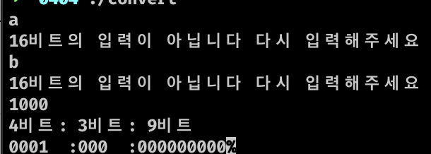
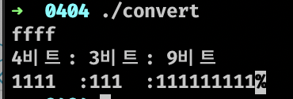

## Report
+ 16비트의 16진수를 입력받아 2진수로 출력
## 코드

```c
#include <stdio.h>
void fuc(unsigned n){   //16진수의 값을 10진수로 불러와 2진수로 변환하는 함수
	for(int i = 15; i >=  0; i--) {. //16비트의 2진수를 출력하기 위해 for문 사용
		if(i == 11 || i == 8) printf("  :");  // 3비트,7비트 씩 끊음
		int output = n >> i & 1; //i번째 자리가 0이면 0출력 1이면 1출력
		printf("%d", output);
	}
}
int main(){
	int input;
	while(1) //반복문을 사용해 16비트의 입력을 받을때 까지 반복문을 돌림
	{
		scanf("%x",&input);
		if(input >= 0x1000 && input <= 0xFFFF) break;	// 16비트의 입력일 경우 반복문 종료
		else printf("16비트의 입력이 아닙니다 다시 입력해주세요\n");
	}
	printf("4비트: 3비트: 9비트\n");
	fuc(input);

	return 0;

}
```

## 결과



