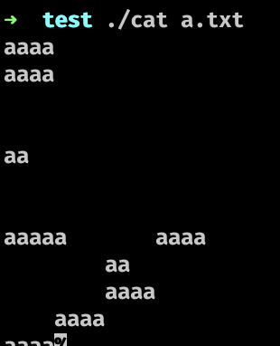
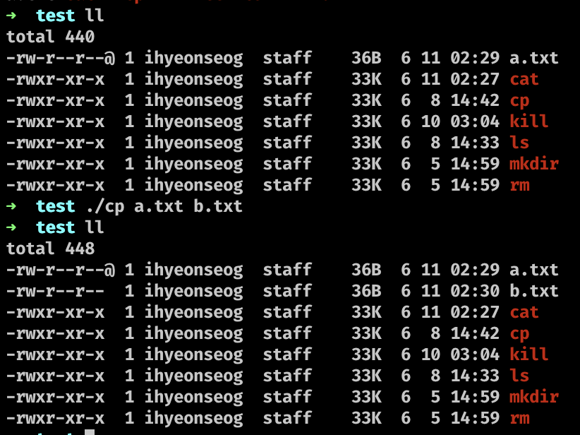
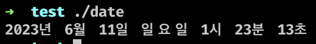
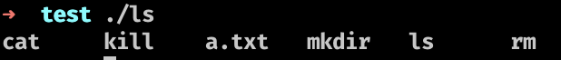
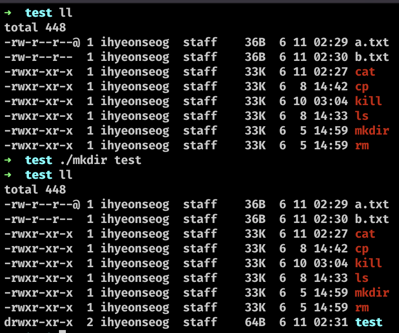
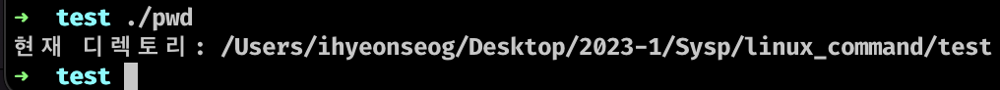
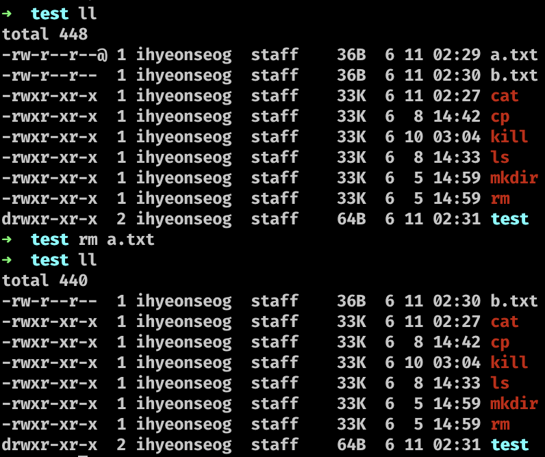
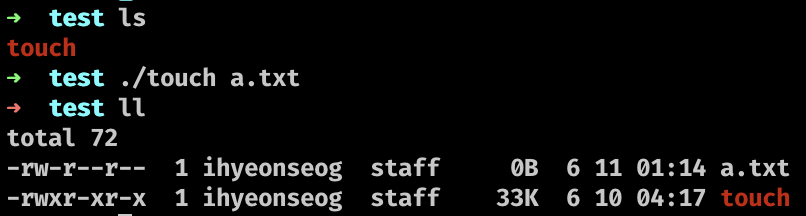
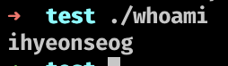
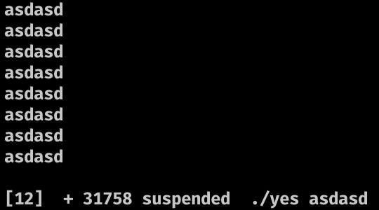

# 리눅스 명령어 구현

이 프로젝트는 C 언어로 구현된 리눅스 명령어들을 포함하고 있습니다. 해당 명령어들은 기본 리눅스 명령어들을 간단한 형태로 재구현한 것입니다.

## 명령어 목록

### `cat`

파일의 내용을 출력합니다.

**옵션:**

- `-n`: 각 줄에 번호를 붙여 출력합니다.
- `-b`: 빈 줄을 제외하고 각 줄에 번호를 붙여 출력합니다.
- `-E`: 각 줄의 끝에 `$` 기호를 표시합니다.
- `-T`: 각 줄의 탭 문자를 `^I`로 바꿔서 출력합니다.
- `-s`: 중복된 빈 줄을 하나로 압축시켜 출력합니다.
**사용 예시:**

```shell
./cat [옵션] <파일명>
```
**실행 화면:**




### `clear`

터미널 화면을 지웁니다.

**사용 예시:**

```shell
./clear
```

### `cp`

파일 또는 디렉토리를 복사합니다.

**사용 예시:**

```shell
./cp <원본파일> <복사할파일>
```

**실행 화면:**


### `date`

현재 시간과 날짜를 출력합니다.

**사용 예시:**
```shell
./date
```

**실행 화면:**


### `echo`

인자로 받은 텍스트를 출력합니다.

**사용 예시:**
```shell
./echo 출력할 메시지
```

**실행 화면:**


### `env`

환경 변수를 출력합니다.

**사용 예시:**
```shell
./env
```

### `false`

항상 실패하는 명령어입니다.

**사용 예시:**
```shell
./false
```

### `hostname`

호스트 이름을 출력합니다.

**사용 예시:**
```shell
./hostname
```

**실행 화면:**


### `kill`

프로세스를 종료합니다.

**사용 예시:**
```shell
./kill <signal> <pid>
```

### `ls`

현재 디렉토리의 파일과 폴더를 나열합니다.

**옵션**
- `-l`: 자세한 파일 및 폴더 정보를 함께 출력합니다.
- `-a`: 숨겨진 파일 및 폴더를 포함하여 모든 파일과 폴더를 나열합니다.
- `-al` 또는 `-la`: 자세한 정보를 포함하여 숨겨진 파일 및 폴더를 포함하여 모든 파일과 폴더를 나열합니다.

**사용 예시:**
```shell
./ls [옵션]
```

**실행 화면:**




### `mkdir`

디렉토리를 생성합니다.

**사용 예시:**
```shell
./mkdir <폴더명>
```

**실행 화면:**


### `pwd`

현재 작업 중인 디렉토리의 경로를 출력합니다.

**사용 예시:**
```shell
./pwd
```

**실행 화면:**



### `rm`

파일 또는 디렉토리를 삭제합니다.

**사용 예시:**
```shell
./rm <파일명>
```

**실행 화면:**


### `sleep`

일정 시간 동안 대기합니다

**사용 예시:**
```shell
./sleep <대기 시간> 
```
- `<대기 시간>`은 대기할 시간을 나타냅니다.
- 시간 단위를 지정할 수 있습니다.
    - s : 대기 시간을 초 단위로 지정합니다. 예: 10s (10초 대기)
    - m : 대기 시간을 분 단위로 지정합니다. 예: 5m (5분 대기)
    - h : 대기 시간을 시간 단위로 지정합니다. 예: 2h (2시간 대기)
    - d : 대기 시간을 일 단위로 지정합니다. 예: 3d (3일 대기)

**실행 화면:**


### `touch`

파일을 생성하거나 수정 시간을 변경합니다.

**사용 예시:**
```shell
./touch <파일명>
```
**실행 화면:**


### `true`

항상 성공하는 명령어입니다.

**사용 예시:**
```shell
./true
```

### `whoami`

현재 사용자 이름을 출력합니다.

**사용 예시:**
```shell
./whoami
```

**실행 화면:**


### `yes`

인자로 받은 텍스트를 반복해서 출력합니다.

**사용 예시:**
```shell
./yes <텍스트>
```

- 아무 입력 없을 시 y 출력

**실행 화면:**


### `uname`

현재 시스템 정보를 출력합니다.

**옵션**
- `-a`: 모든 시스템 정보를 표시합니다.
- `-s`: 커널 이름을 표시합니다.
- `-n`: 네트워크 노드 이름을 표시합니다. 일반적으로 호스트 컴퓨터의 이름을 의미합니다.
- `-r`: 커널의 버전 번호를 표시합니다.
- `-v`: 커널의 상세한 버전 정보를 표시합니다.

- 아무 입력 없을 시 -s 옵션과 동일한 커널 이름을 표시함
**실행 화면:**


